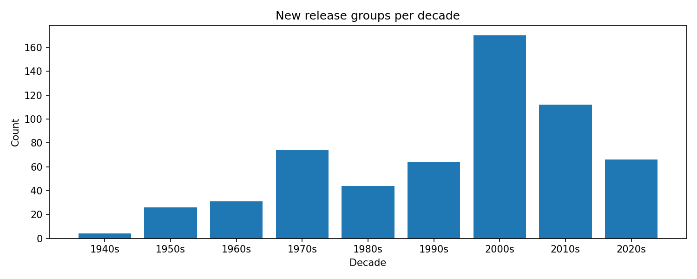

# Music Explorer

Live demo: https://kuhl-music-explorer.streamlit.app/ (after deploy)

The **Music Explorer** project uses the [MusicBrainz](https://musicbrainz.org/) API, pulling structured data on artists, releases, and genres, cleaning and reshaping it into timelines, collaboration graphs, and trend visualizations. The project demonstrates end-to-end analytics skills: sourcing, schema-robust transforms, tests, CI, and a deployed app. 

## What to notice
- Collaboration clusters are genre-tight with producer hubs bridging pop/hip-hop.
- 1990s–2010s show a rise then plateau in release groups; 2020 dip likely pandemic-related.
- Artist timelines reveal multi-year gaps around label changes and side projects.

## Definition of Success 
Success is measured by three criteria:  
1. Reliability and speed of queries (artist or release results in under three seconds).  
2. Accuracy of derived genre and collaboration metrics against spot-checks from the source.  
3. Engagement with the app, where users navigate at least three distinct visualizations per session.  

The result is a reproducible, cloud-hosted portfolio artifact that highlights skills in API integration, data modeling, and interactive storytelling.

---

  
*Source: MusicBrainz, CC BY-NC-SA 4.0, pulled 2025-08-28.*

## Caption standard:
Source: MusicBrainz (CC BY-NC-SA 4.0). Pulled YYYY-MM-DD. “Music metadata provided by MusicBrainz.”

---
## Repo Map

- **README.md** — Project overview, usage guide  
- **Makefile** — Repro targets (`setup`, `pull`, `clean`, `build`, `test`, `run`, `report`)  
- **app/** — Application code  
  - `Main.py` — Streamlit UI (Overview, Explore, Download)  
  - `pipeline/` — Data pipeline scripts (`pull_sample.py`, `clean.py`, `build.py`)  
  - `figures/` — Chart exporters for docs  
  - `report/` — ReportLab PDF builder  
  - `tools/` — Schema helpers (emit/enrich dictionary)  
- **data/**  
  - `raw/` — JSON from MusicBrainz API  
  - `clean/` — Normalized Parquet tables  
  - `marts/` — Aggregated CSV/Parquet for app + viz  
- **docs/**  
  - `figures/` — Exported PNGs (hero + top-5 genres)  
  - `report.pdf` — Two-page summary for non-technical readers  
- **tests/** — Unit tests and schema assertions  
- **env/**  
  - `.env.example` — Template env vars (with User-Agent string)  
  - `requirements.txt` — Python deps  
- **DATA_DICTIONARY.csv** — Raw → Clean → Mart schema map  
- **PROVENANCE.md** — Data sourcing details, pull commands  
- **LICENSE_NOTES.md** — Notes on MusicBrainz licensing (CC BY-NC-SA)  
- **.github/workflows/** — CI config (`ci.yml`)  

## Quick Start
Clone the repo and run the pipeline end-to-end:

git clone https://github.com/bkuhlman80/music-explorer.git
cd music-explorer

make setup                     # create .venv and install deps
make pull ARTIST="Daft Punk"   # fetch raw JSON from MusicBrainz
make clean                     # normalize to clean/ tables
make build                     # build marts/ aggregates
make run                       # launch Streamlit app at http://localhost:8501

Optional:
make figures → export charts to docs/figures/
make report → build docs/report.pdf
make test → run unit tests
make deploy → push repo + trigger CI